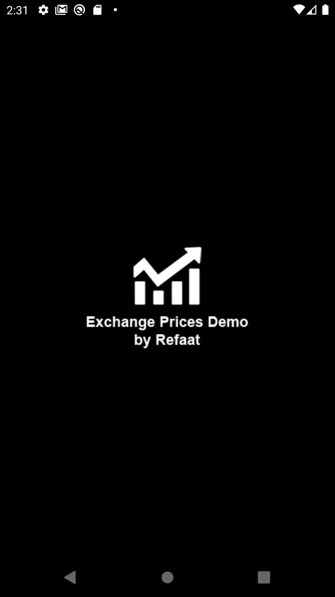
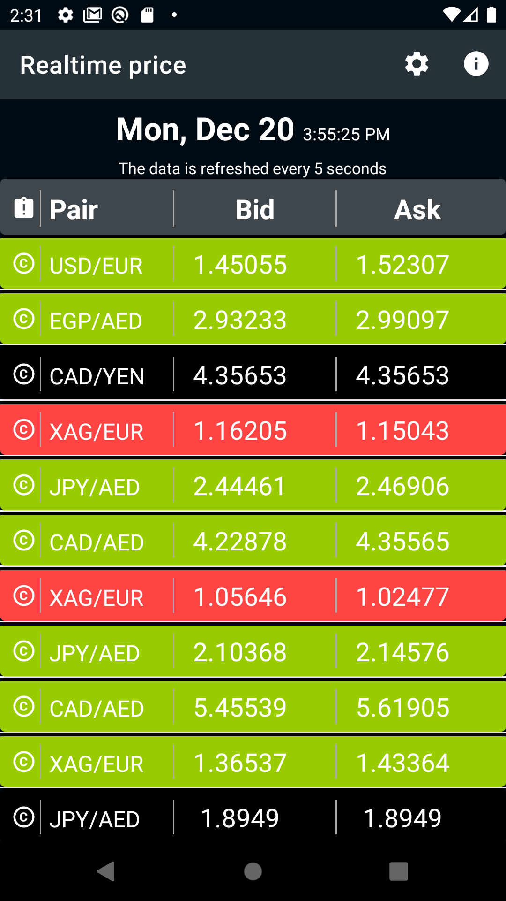
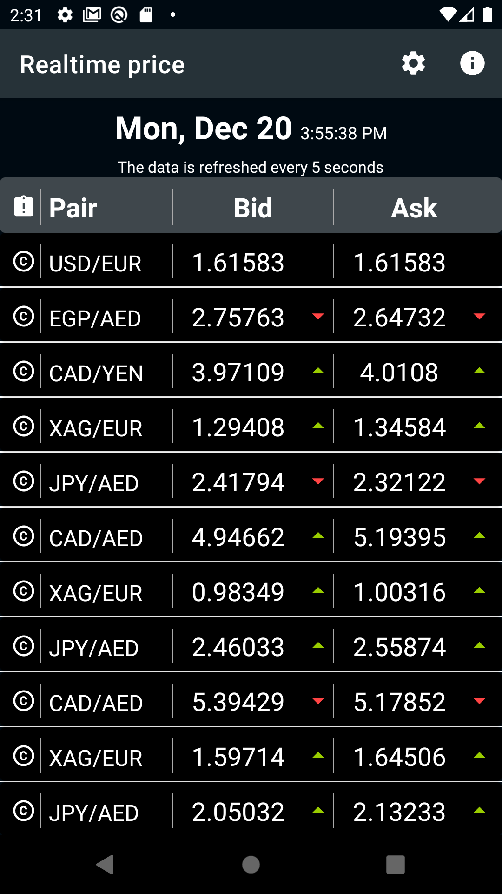
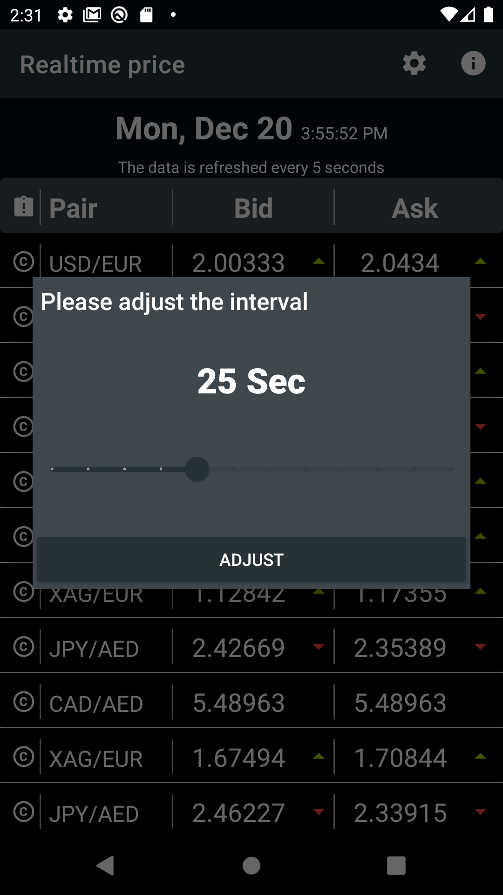
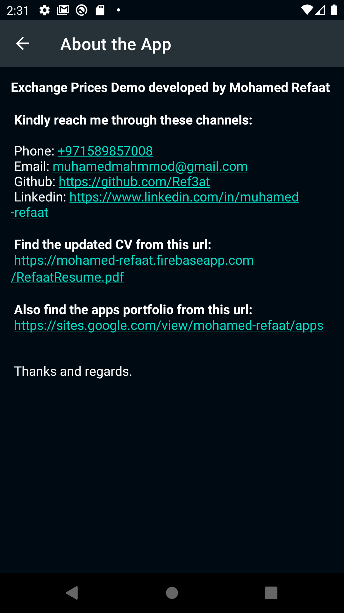

Exchange Prices Demo by Refaat
===================================

This demo shows a UI simulation of the real-time update of the currency pair prices in a list and graph.

Get The APK:
--------------

The app tech:
--------------

- Java 8.
- Android SDK 32.
- MVVM architecture design pattern.
- ViewModel.
- LiveData.
- Navigation component (safeargs).
- secure shared preferences. 
- Material design. 

Screenshots
-------------

 
 
 

 
 
 

